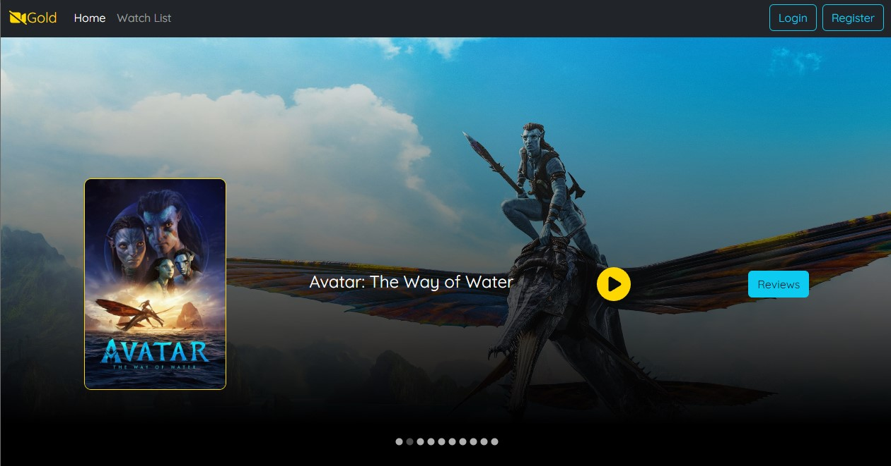
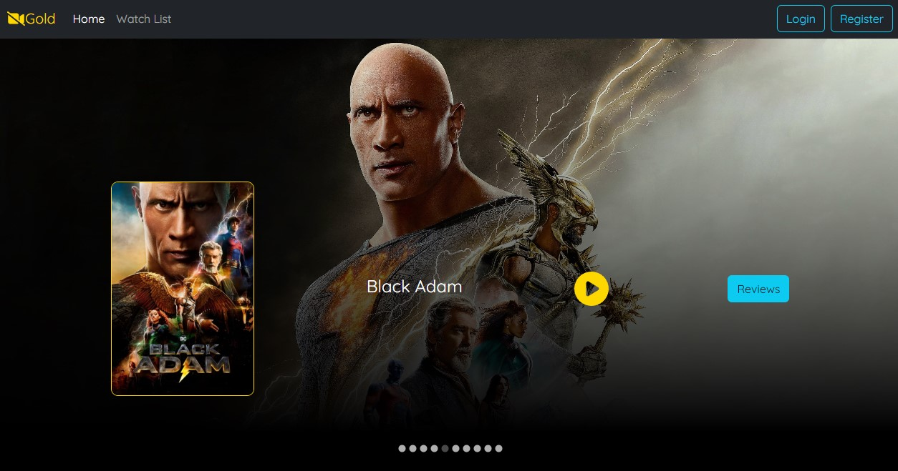
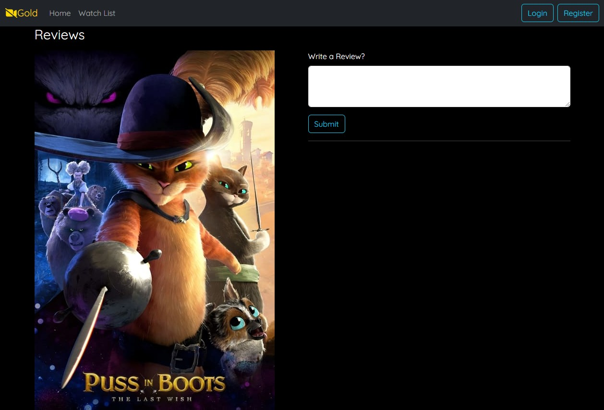

# movies-spring-boot-mongodb-backend

This is a REST API application powered by Spring Boot for movie application.

Technologies:
* Spring Boot;
* MongoDB.

## Installation & Usage

```bash
$ git clone https://github.com/vlad777442/movies-spring-boot-mongodb-backend
```
* Configure MongoDB atlas:


[http://localhost:8080/api/v1/movies](http://localhost:8080/api/v1/movies)


[React Frontend (Click Here)](https://github.com/vlad777442/movies-react-frontend)



